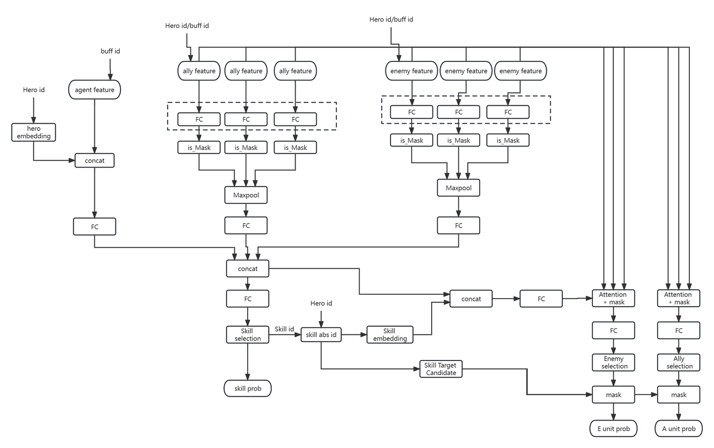

# ENV

tensorflow==2.6.2

numpy==1.19.5

gym==0.21.0

# Imitation Learning
0. 预处理
- python -m rl.analysis_tool.process_mp 处理原始json数据得到训练参数, 修改 rl/env/act_obs_space.py中的参数, 并修改rl/env/agent/feature_def.py中对应的参数（buffer id下面的参数）
- python -m rl.env.agent.feature_def 生成特征文件
- python -m rl.train.preprocess 16 v332 生成version pt数据文件，采用process_num个进程

1. 训练
cd op_sl/
sh train.sh
（参数配置在rl/train_sl/config.py）

2. kill:  pkill -f "/usr/bin/python3 -c from multiprocessing" && pkill -f "python3 -m rl.train.train"

3. 预测
cd op_sl/
sh pred.sh

